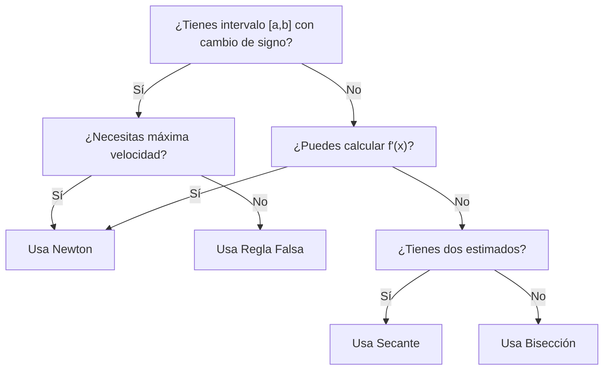

# Cheat Sheet: Métodos Numéricos
## Análisis Numérico - EAFIT

Documento de referencia rápida para todos los métodos numéricos implementados, agrupados por categoría con comparativas, ventajas, desventajas e información técnica.

---

## 📋 Tabla de Contenidos
1. [Ecuaciones No Lineales](#ecuaciones-no-lineales)
2. [Sistemas de Ecuaciones Lineales](#sistemas-de-ecuaciones-lineales)
3. [Interpolación](#interpolación)
4. [Matriz Comparativa General](#matriz-comparativa-general)

---

## Ecuaciones No Lineales

Métodos para encontrar raíces de ecuaciones del tipo $f(x) = 0$.

### 1. Bisección

**Descripción:** Método de búsqueda que divide repetidamente un intervalo en dos mitades, seleccionando la subintervalo que contiene la raíz.

**Fórmula:**
$$x_m = \frac{a + b}{2}$$

| Aspecto | Descripción |
|--------|------------|
| **Requisito Previo** | $f(a) \cdot f(b) < 0$ (cambio de signo) |
| **Convergencia** | Lineal (lenta pero segura) |
| **Velocidad** | Lenta ($O(\log(1/\epsilon))$ iteraciones) |
| **Orden de Convergencia** | 1 |
| **Complejidad** | $O(n)$ donde $n$ = número de iteraciones |

**Ventajas:**
- ✅ **Garantizado:** Siempre converge si hay cambio de signo
- ✅ **Robusto:** No requiere derivadas
- ✅ **Simple:** Implementación trivial
- ✅ **Predecible:** Se puede calcular el número de iteraciones a priori
- ✅ **Estable:** No hay problemas numéricos graves

**Desventajas:**
- ❌ **Lento:** Convergencia lineal
- ❌ **Requiere intervalo:** Necesita $[a,b]$ con cambio de signo
- ❌ **Una raíz por vez:** No encuentra múltiples raíces simultáneamente
- ❌ **Información desperdiciada:** Solo usa el signo, no la magnitud de $f(x)$

**Casos de Uso:**
- Cuando se garantiza que existe una raíz en el intervalo
- Cuando se necesita máxima seguridad y no importa el tiempo
- Como método inicial para localizar raíces aproximadas
- En sistemas embebidos o con recursos limitados

---

### 2. Newton-Raphson

**Descripción:** Método iterativo que usa la derivada para aproximarse a la raíz con convergencia cuadrática.

**Fórmula:**
$$x_{n+1} = x_n - \frac{f(x_n)}{f'(x_n)}$$

| Aspecto | Descripción |
|--------|------------|
| **Requisito Previo** | $f'(x) \neq 0$ en la región de interés |
| **Convergencia** | Cuadrática (muy rápida) |
| **Orden de Convergencia** | 2 |
| **Velocidad** | Rápida (~12 dígitos en 4 iteraciones típicamente) |
| **Complejidad** | $O(\log \log(1/\epsilon))$ |

**Ventajas:**
- ✅ **Muy rápido:** Convergencia cuadrática
- ✅ **Flexible:** Funciona sin intervalo inicial específico
- ✅ **Pocos requisitos:** Solo necesita $f$ y $f'$
- ✅ **Excelente precisión:** Alcanza precisión máquina en pocas iteraciones
- ✅ **Múltiples raíces:** Puede encontrar varias con diferentes inicios

**Desventajas:**
- ❌ **Requiere derivada:** Debe conocerse $f'(x)$ analíticamente
- ❌ **Puede divergir:** Si $x_0$ no está suficientemente cerca
- ❌ **Singularidades:** Falla si $f'(x_n) = 0$
- ❌ **Más cálculos:** Requiere evaluar $f$ y $f'$
- ❌ **Raíces múltiples:** Convergencia lenta si $f'(\alpha) = 0$

**Casos de Uso:**
- Cuando se puede calcular la derivada analíticamente
- Cuando se necesita convergencia rápida
- En problemas científicos donde la precisión es crítica
- Cuando hay buen estimado inicial disponible

---

### 3. Punto Fijo (Iteración Funcional)

**Descripción:** Reescribe $f(x) = 0$ como $x = g(x)$ y aplica iteración $x_{n+1} = g(x_n)$.

**Fórmula:**
$$x_{n+1} = g(x_n)$$

| Aspecto | Descripción |
|--------|------------|
| **Requisito Previo** | $\|g'(x)\| < 1$ en la región convergente |
| **Convergencia** | Lineal (generalmente) |
| **Orden de Convergencia** | 1 (o superior si $g'(\alpha) = 0$) |
| **Velocidad** | Lenta a moderada |
| **Estabilidad** | Depende de la elección de $g(x)$ |

**Ventajas:**
- ✅ **Flexible:** Muchas formas de expresar $g(x)$
- ✅ **Simple:** Iteración básica sin derivadas
- ✅ **Rápido de programar:** Código muy conciso
- ✅ **Converge bajo condiciones:** Si $|g'(x)| < 1$ localmente

**Desventajas:**
- ❌ **Sensible a $g(x)$:** La elección de función es crítica
- ❌ **Convergencia lenta:** Lineal típicamente
- ❌ **Difícil de garantizar:** No hay test simple de convergencia a priori
- ❌ **Puede divergir:** Sin análisis previo del dominio
- ❌ **Múltiples raíces:** Requiere diferentes funciones $g(x)$

**Casos de Uso:**
- Cuando se puede reformular $f(x) = 0$ naturalmente como $x = g(x)$
- En métodos especializados (ej: iteración de Newton para sistemas)
- Cuando la simplicidad es más importante que la velocidad
- En análisis de convergencia de otros métodos

---

### 4. Secante

**Descripción:** Aproxima la derivada usando diferencias finitas. Variante de Newton sin derivada analítica.

**Fórmula:**
$$x_{n+1} = x_n - f(x_n) \cdot \frac{x_n - x_{n-1}}{f(x_n) - f(x_{n-1})}$$

| Aspecto | Descripción |
|--------|------------|
| **Requisito Previo** | Dos puntos iniciales $x_0, x_1$ |
| **Convergencia** | Superlineal (~1.618, razón áurea) |
| **Orden de Convergencia** | $\phi \approx 1.618$ |
| **Velocidad** | Rápida (entre lineal y cuadrática) |
| **Complejidad** | $O(\text{iteraciones})$ |

**Ventajas:**
- ✅ **Sin derivada:** No requiere $f'(x)$ analítica
- ✅ **Convergencia rápida:** Orden $\phi$, mejor que lineal
- ✅ **Flexibilidad:** Funciona sin derivada
- ✅ **Dos puntos:** Solo necesita estimados iniciales
- ✅ **Práctico:** Balance entre simplicidad y velocidad

**Desventajas:**
- ❌ **Menos preciso que Newton:** Convergencia más lenta
- ❌ **Dos valores iniciales:** Requiere $x_0$ y $x_1$
- ❌ **Puede divergir:** Sin análisis de convergencia
- ❌ **División por cero:** Si $f(x_n) = f(x_{n-1})$
- ❌ **Más iteraciones:** Necesita más pasos que Newton

**Casos de Uso:**
- Cuando la derivada no se conoce o es difícil de calcular
- Como alternativa a diferencias finitas en Newton
- En métodos sin cálculo de derivadas
- Cuando se tienen dos aproximaciones iniciales

---

### 5. Regla Falsa (Posición Falsa)

**Descripción:** Híbrido de bisección y secante. Conecta dos puntos con signo opuesto mediante una línea recta.

**Fórmula:**
$$x_m = \frac{a \cdot f(b) - b \cdot f(a)}{f(b) - f(a)}$$

| Aspecto | Descripción |
|--------|------------|
| **Requisito Previo** | $f(a) \cdot f(b) < 0$ |
| **Convergencia** | Superlineal |
| **Orden de Convergencia** | Entre 1 y 2 |
| **Velocidad** | Más rápida que bisección, más lenta que Newton |
| **Complejidad** | $O(\text{iteraciones})$ |

**Ventajas:**
- ✅ **Convergente:** Siempre converge dentro de intervalo
- ✅ **Usa información:** Aprovecha la magnitud de $f(x)$
- ✅ **Más rápido que bisección:** Convergencia superlineal
- ✅ **Robusto:** No requiere derivada
- ✅ **Híbrido eficiente:** Combina ventajas de bisección y secante

**Desventajas:**
- ❌ **Requiere intervalo:** Necesita cambio de signo
- ❌ **Convergencia unilateral:** Un extremo puede quedarse fijo
- ❌ **Menos rápido que Newton:** No es cuadrático
- ❌ **Complejidad media:** Más cálculos que bisección
- ❌ **Una raíz por vez:** No simultáneamente

**Casos de Uso:**
- Cuando se tiene intervalo con cambio de signo
- Balance entre velocidad de Newton y seguridad de bisección
- En métodos robustos que no pueden divergir
- Cuando se necesita mejora sobre bisección básico

---

### 6. Raíces Múltiples (Método de Deflación)

**Descripción:** Encuentra raíces múltiples ($f(\alpha) = f'(\alpha) = 0$) dividiendo por $(x - \alpha)$ sucesivamente.

**Fórmula:**
$$f_1(x) = \frac{f(x)}{x - \alpha_1}, \quad f_2(x) = \frac{f_1(x)}{x - \alpha_2}, \ldots$$

| Aspecto | Descripción |
|--------|------------|
| **Requisito Previo** | Método base (Newton) + raíces anteriores |
| **Convergencia** | Depende del método base |
| **Orden de Convergencia** | Heredado del método base |
| **Velocidad** | Moderada (requiere múltiples fases) |
| **Estabilidad** | Puede acumular errores |

**Ventajas:**
- ✅ **Múltiples raíces:** Encuentra todas las raíces
- ✅ **Sistemático:** Proceso automatizado
- ✅ **Flexible:** Funciona con varios métodos base
- ✅ **Información completa:** Historial de todas las raíces
- ✅ **Adaptable:** Se puede refinar cada raíz

**Desventajas:**
- ❌ **Acumulación de errores:** Cada deflación suma imprecisión
- ❌ **Inestabilidad numérica:** Los polinomios deflacionados pueden ser mal condicionados
- ❌ **Orden de importancia:** Mejor encontrar raíces grandes primero
- ❌ **Polinomios mal condicionados:** Aproximaciones deficientes
- ❌ **Refinamiento necesario:** Requiere mejora posterior

**Casos de Uso:**
- Cuando se sabe que existen múltiples raíces
- En análisis de polinomios
- Cuando se necesita información completa sobre todas las raíces
- En combinación con métodos más estables (como QR)

---

### Matriz Comparativa: Ecuaciones No Lineales

| Método | Convergencia | Velocidad | Requisitos | Robustez | Éxito |
|--------|--------------|-----------|-----------|----------|-------|
| **Bisección** | Lineal | ⭐ | Intervalo | ⭐⭐⭐⭐⭐ | 100% |
| **Newton** | Cuadrática | ⭐⭐⭐⭐⭐ | $f, f'$ | ⭐⭐⭐ | 80% |
| **Secante** | Superlineal | ⭐⭐⭐⭐ | Dos puntos | ⭐⭐⭐ | 85% |
| **Punto Fijo** | Lineal | ⭐⭐ | $g(x)$ | ⭐⭐ | 60% |
| **Regla Falsa** | Superlineal | ⭐⭐⭐ | Intervalo | ⭐⭐⭐⭐ | 95% |
| **Raíces Múltiples** | Variable | ⭐⭐⭐ | Método base | ⭐⭐ | 70% |

---

## Sistemas de Ecuaciones Lineales

Métodos iterativos para resolver $Ax = b$ donde $A$ es matriz $n \times n$.

### 1. Jacobi

**Descripción:** Método iterativo que despeja cada variable en términos de las demás en su ecuación.

**Fórmula:**
$$x_i^{(k+1)} = \frac{1}{a_{ii}}\left(b_i - \sum_{j \neq i} a_{ij}x_j^{(k)}\right)$$

| Aspecto | Descripción |
|--------|------------|
| **Convergencia** | Depende del radio espectral |
| **Condición** | $\rho(D^{-1}(L+U)) < 1$ |
| **Velocidad** | Lenta a moderada |
| **Orden** | Linear |
| **Complejidad por iteración** | $O(n^2)$ |

**Ventajas:**
- ✅ **Simple:** Fácil de implementar
- ✅ **Paralelizable:** Cada variable se calcula independientemente
- ✅ **Sin factorización:** No requiere descomposición LU
- ✅ **Memoria eficiente:** Almacenamiento bajo
- ✅ **Flexible:** Fácil de adaptar a patrones

**Desventajas:**
- ❌ **Lento:** Convergencia lineal
- ❌ **Muchas iteraciones:** Requiere pasos numerosos
- ❌ **Condición diagonal:** $|a_{ii}|$ debe ser dominante
- ❌ **No siempre converge:** Requiere análisis previo
- ❌ **Precisión limitada:** Acumulación de errores

**Casos de Uso:**
- Sistemas con diagonal dominante
- Problemas donde paralelización es esencial
- Matrices dispersas grandes
- Cuando se necesita programación simple

**Criterio de Convergencia:**
Converge si la matriz es **diagonalmente dominante**: $|a_{ii}| > \sum_{j \neq i}|a_{ij}|$ para todos los $i$.

---

### 2. Gauss-Seidel

**Descripción:** Mejora de Jacobi que usa valores actualizados tan pronto como están disponibles.

**Fórmula:**
$$x_i^{(k+1)} = \frac{1}{a_{ii}}\left(b_i - \sum_{j < i} a_{ij}x_j^{(k+1)} - \sum_{j > i} a_{ij}x_j^{(k)}\right)$$

| Aspecto | Descripción |
|--------|------------|
| **Convergencia** | Más rápida que Jacobi |
| **Condición** | Similar a Jacobi |
| **Velocidad** | Moderada |
| **Orden** | Linear (pero constante menor) |
| **Complejidad por iteración** | $O(n^2)$ |

**Ventajas:**
- ✅ **Más rápido que Jacobi:** ~2x mejor convergencia
- ✅ **Simple:** Solo cambio en Jacobi
- ✅ **Usa información actualizada:** Aprovecha nuevos valores inmediatamente
- ✅ **Menos iteraciones:** Converge más rápido
- ✅ **Igual complejidad:** Sin costo adicional por iteración

**Desventajas:**
- ❌ **No paralelizable:** Orden secuencial requerido
- ❌ **Más lento que Newton:** Comparado con métodos directos
- ❌ **Errores acumulativos:** Puede haber propagación de errores
- ❌ **Requiere diagonal dominante:** Misma condición que Jacobi
- ❌ **Convergencia variable:** Depende de ordenamiento de ecuaciones

**Casos de Uso:**
- Cuando se necesita mejor convergencia que Jacobi
- Sistemas donde paralelización no es posible
- Métodos iterativos para precondicionamiento
- Problemas diferenciales discretizados

**Nota:** Mejor elegir Gauss-Seidel sobre Jacobi cuando es posible.

---

### 3. SOR (Successive Over-Relaxation)

**Descripción:** Generalización de Gauss-Seidel con parámetro de relajación $\omega$ para acelerar convergencia.

**Fórmula:**
$$x_i^{(k+1)} = (1-\omega)x_i^{(k)} + \frac{\omega}{a_{ii}}\left(b_i - \sum_{j < i} a_{ij}x_j^{(k+1)} - \sum_{j > i} a_{ij}x_j^{(k)}\right)$$

| Aspecto | Descripción |
|--------|------------|
| **Convergencia** | Óptima con $\omega$ correcto |
| **Parámetro** | $\omega \in (0, 2)$; típicamente $\omega \in (1, 2)$ |
| **$\omega = 1$** | Coincide con Gauss-Seidel |
| **Velocidad** | Puede ser 2-10x más rápido |
| **Orden** | Linear (con mejor constante) |

**Ventajas:**
- ✅ **Muy rápido:** Con $\omega$ óptimo, mucho más rápido
- ✅ **Flexible:** Parámetro $\omega$ para ajuste fino
- ✅ **Generaliza:** Incluye Jacobi y Gauss-Seidel
- ✅ **Aceleración significativa:** Reduce iteraciones dramáticamente
- ✅ **Teórico bien establecido:** Existe análisis completo

**Desventajas:**
- ❌ **Encontrar $\omega$ óptimo:** No es trivial
- ❌ **Sensible a $\omega$:** Mal $\omega$ empeora convergencia
- ❌ **No paralelizable:** Secuencial como Gauss-Seidel
- ❌ **Complejidad análisis:** Requiere teoría espectral
- ❌ **Puede divergir:** Si $\omega$ está fuera de rango

**Óptimo $\omega$:**
Para ciertos problemas (como discretización de Laplaciano):
$$\omega_{opt} = \frac{2}{1 + \sqrt{1 - \rho^2}}$$
donde $\rho$ es el radio espectral de Jacobi.

**Casos de Uso:**
- Problemas bien caracterizados donde $\omega_{opt}$ se conoce
- Métodos iterativos precondicionadores para gradiente conjugado
- Discretización de ecuaciones diferenciales
- Cuando la velocidad es crítica

---

### Matriz Comparativa: Sistemas Lineales

| Método | Velocidad | Complejidad | Paralelizable | Facilidad | Óptimo |
|--------|-----------|------------|---------------|-----------|--------|
| **Jacobi** | ⭐ | $O(n^2)$ | ✅ Sí | ⭐⭐⭐⭐⭐ | NO |
| **Gauss-Seidel** | ⭐⭐⭐ | $O(n^2)$ | ❌ No | ⭐⭐⭐⭐ | NO |
| **SOR** | ⭐⭐⭐⭐⭐ | $O(n^2)$ | ❌ No | ⭐⭐ | SÍ |

**Recomendación:** Usar SOR si $\omega_{opt}$ se puede calcular; si no, Gauss-Seidel.

---

## Interpolación

Métodos para construir polinomios que pasan por puntos dados.

### 1. Vandermonde

**Descripción:** Resuelve el sistema $V \cdot c = y$ donde $V_{ij} = x_i^{j-1}$ para obtener coeficientes del polinomio.

**Sistema:**
$$\begin{pmatrix} 1 & x_0 & x_0^2 & \cdots & x_0^{n} \\ 1 & x_1 & x_1^2 & \cdots & x_1^{n} \\ \vdots & \vdots & \vdots & \ddots & \vdots \\ 1 & x_n & x_n^2 & \cdots & x_n^{n} \end{pmatrix} \begin{pmatrix} c_0 \\ c_1 \\ \vdots \\ c_n \end{pmatrix} = \begin{pmatrix} y_0 \\ y_1 \\ \vdots \\ y_n \end{pmatrix}$$

| Aspecto | Descripción |
|--------|------------|
| **Complejidad** | $O(n^3)$ para resolución |
| **Grado** | $n$ (exactamente $n+1$ puntos) |
| **Forma** | $P(x) = c_0 + c_1 x + c_2 x^2 + \cdots + c_n x^n$ |
| **Almacenamiento** | $O(n^2)$ |
| **Evaluación** | $O(n^2)$ por punto |

**Ventajas:**
- ✅ **Simple conceptualmente:** Directo del álgebra lineal
- ✅ **Forma estándar:** Coeficientes inmediatamente usables
- ✅ **Evaluación directa:** Horner's method eficiente
- ✅ **Fácil programación:** Sin trucos algorítmicos especiales
- ✅ **Análisis claro:** Teoría bien establecida

**Desventajas:**
- ❌ **Mal condicionado:** Matriz de Vandermonde es mal condicionada
- ❌ **Lento:** $O(n^3)$ para resolución
- ❌ **Inestable numéricamente:** Especialmente para $n$ grande
- ❌ **Fenómeno de Runge:** Oscilaciones en los extremos
- ❌ **No escalable:** Impractico para muchos puntos

**Fenómeno de Runge:**
Para $n$ grande con puntos equiespaciados, el polinomio oscila wildly en los extremos. Solución: usar puntos de Chebyshev.

**Casos de Uso:**
- Puntos pequeños ($n < 10$)
- Cuando se necesitan coeficientes explícitamente
- Propósitos educativos/teóricos
- Puntos de Chebyshev distribuidos

---

### 2. Lagrange

**Descripción:** Construye polinomio directamente como combinación de polinomios de Lagrange.

**Fórmula:**
$$P(x) = \sum_{i=0}^{n} y_i L_i(x), \quad L_i(x) = \prod_{j \neq i} \frac{x - x_j}{x_i - x_j}$$

| Aspecto | Descripción |
|--------|------------|
| **Complejidad** | $O(n^2)$ para evaluación |
| **Grado** | $n$ |
| **Forma** | Polinomios de Lagrange implícitos |
| **Almacenamiento** | $O(n)$ |
| **Evaluación** | $O(n^2)$ por punto |

**Ventajas:**
- ✅ **Directo:** Sin resolver sistema lineal
- ✅ **Flexibilidad:** Añadir un punto sin recomputar todo
- ✅ **Interpretación clara:** Cada término es un polinomio individual
- ✅ **Estable:** Mejor que Vandermonde
- ✅ **Evaluación explícita:** Sin factorización LU

**Desventajas:**
- ❌ **Evaluación lenta:** $O(n^2)$ por punto
- ❌ **Coeficientes implícitos:** No se obtienen explícitamente
- ❌ **Recalculación:** Si se añade un punto, reevaluar todo
- ❌ **Fenómeno de Runge:** Mismo problema que Vandermonde
- ❌ **Menos eficiente:** Para muchas evaluaciones

**Casos de Uso:**
- Pocos puntos (n < 20)
- Cuando se necesita flexibilidad en adiciones de puntos
- Métodos de integración numérica (cuadratura)
- Cuando la estabilidad es prioritaria

---

### 3. Newton (Divididas Diferencias)

**Descripción:** Usa tabla de diferencias divididas para forma incremental del polinomio.

**Tabla de Diferencias Divididas:**
$$f[x_i, x_{i+1}, \ldots, x_{i+k}] = \frac{f[x_{i+1}, \ldots, x_{i+k}] - f[x_i, \ldots, x_{i+k-1}]}{x_{i+k} - x_i}$$

**Polinomio:**
$$P(x) = f[x_0] + f[x_0,x_1](x-x_0) + f[x_0,x_1,x_2](x-x_0)(x-x_1) + \cdots$$

| Aspecto | Descripción |
|--------|------------|
| **Complejidad** | $O(n^2)$ construcción, $O(n)$ evaluación |
| **Grado** | $n$ |
| **Forma** | Newton incremental |
| **Almacenamiento** | $O(n)$ para tabla |
| **Evaluación** | $O(n)$ con Horner (eficiente) |

**Ventajas:**
- ✅ **Muy eficiente:** $O(n)$ para Horner
- ✅ **Incremental:** Añadir punto sin recomputar tabla completa
- ✅ **Coeficientes estables:** Mejor condicionamiento numérico
- ✅ **Integración fácil:** Base para métodos numéricos
- ✅ **Derivadas:** Fácil acceso a derivadas sucesivas

**Desventajas:**
- ❌ **Fenómeno de Runge:** Mismo que otros
- ❌ **Tabla grande:** $O(n^2)$ memoria para tabla
- ❌ **Menos intuitivo:** La tabla requiere comprensión
- ❌ **Coeficientes implícitos:** Forma estándar requiere conversión
- ❌ **Conversión costosa:** $O(n^2)$ a forma estándar

**Casos de Uso:**
- Interpolación con muchos puntos
- Métodos iterativos que requieren actualización
- Integración y diferenciación numérica
- Análisis de error (diferencias divididas)

---

### 4. Spline Cúbico

**Descripción:** Divide el intervalo en segmentos, cada uno con polinomio cúbico diferente, con continuidad de $C^2$.

**Condiciones:**
- Cada segmento: polinomio cúbico
- En nudos: continuidad de función, primera y segunda derivada
- Frontera: natural ($S''(a) = S''(b) = 0$) o sujetada

| Aspecto | Descripción |
|--------|------------|
| **Complejidad** | $O(n)$ resolución (tridiagonal) |
| **Grado local** | 3 (cúbico) |
| **Suavidad** | $C^2$ (segunda derivada continua) |
| **Almacenamiento** | $O(n)$ |
| **Evaluación** | $O(1)$ por punto (búsqueda + evaluación) |

**Ventajas:**
- ✅ **Suave:** Continuidad de segunda derivada
- ✅ **Sin oscilaciones:** Evita fenómeno de Runge
- ✅ **Eficiente:** $O(n)$ construcción y $O(1)$ evaluación
- ✅ **Local:** Error localizado, no global
- ✅ **Estable:** Bien condicionado numéricamente
- ✅ **Natural:** Sin información adicional en frontera

**Desventajas:**
- ❌ **Más complejo:** Require sistema tridiagonal
- ❌ **Cúbico local:** Menos flexible que grado alto
- ❌ **Sistema a resolver:** No es directo como Lagrange
- ❌ **Frontera necesaria:** Requiere condiciones de borde
- ❌ **No polinomio único:** Múltiples splines posibles

**Comparativa con Polinomio Único:**
- Spline: Suave, sin oscilaciones, local
- Polinomio grado $n$: Cúbico "equivalente" en suavidad, pero menos oscilaciones

**Casos de Uso:**
- **Interpolación general:** Primera opción para precisión
- **Gráficos suaves:** Renderizado de curvas
- **Aproximación de funciones:** Cuando se necesita suavidad
- **Muchos puntos:** $n > 20$ donde Vandermonde fallaría
- **Procesamiento de imágenes:** Interpolación de píxeles

---

### Matriz Comparativa: Interpolación

| Método | Construcción | Evaluación | Estabilidad | Suavidad | Scalable |
|--------|--------------|-----------|------------|----------|----------|
| **Vandermonde** | $O(n^3)$ | $O(n)$ | ⭐ | $C^{\infty}$ | ❌ |
| **Lagrange** | $O(n^2)$ | $O(n^2)$ | ⭐⭐ | $C^{\infty}$ | ❌ |
| **Newton** | $O(n^2)$ | $O(n)$ | ⭐⭐⭐ | $C^{\infty}$ | ⭐⭐ |
| **Spline** | $O(n)$ | $O(1)$ | ⭐⭐⭐⭐⭐ | $C^2$ | ✅ |

**Recomendación:**
- **Spline:** Primera opción general
- **Newton:** Si se necesita incrementalidad
- **Lagrange:** Si se necesita acceso a coeficientes individuales
- **Vandermonde:** Evitar para $n > 10$

---

## Matriz Comparativa General

### Por Velocidad de Convergencia

```
Rápido      Newton          (cuadrática)
            Secante         (superlineal ~1.618)
            SOR             (lineal, pero rápido)
            
Moderado    Gauss-Seidel   (lineal)
            Regla Falsa     (superlineal)
            Punto Fijo      (lineal)
            
Lento       Bisección      (lineal, lenta)
            Jacobi         (lineal, lenta)
```

### Por Robustez/Garantía

```
Garantizado Bisección      (100% si hay cambio de signo)
            Regla Falsa    (95%+ si hay cambio de signo)
            
Alto        Newton         (~80%)
            Secante        (~85%)
            Spline         (~100% si $n$ razonable)
            
Condicional Punto Fijo     (~60%, depende de $g(x)$)
            SOR            (~80%, depende de $\omega$)
```

### Por Facilidad de Uso

```
Muy Fácil   Bisección      (2 líneas de código)
            Jacobi         (3 líneas)
            Spline         (librería)
            
Fácil       Newton         (si derivada disponible)
            Lagrange       (directo)
            Gauss-Seidel   (simple)
            
Complejo    Punto Fijo     (requiere reformulación)
            Vandermonde    (solución sistema lineal)
            SOR            (encontrar $\omega$ óptimo)
```

---

## Guía de Selección Rápida

### ¿Necesitas encontrar una raíz de $f(x) = 0$?



### ¿Necesitas resolver $Ax = b$?

- Matriz pequeña ($n < 1000$) sin estructura especial → **Eliminación Gaussiana** (directo)
- Matriz grande dispersa → **Gauss-Seidel** o **SOR**
- Paralelización crítica → **Jacobi**
- Máxima velocidad → **SOR con $\omega_{opt}$**

### ¿Necesitas interpolar puntos?

- Pocos puntos ($n < 10$) → **Lagrange** o **Newton**
- Muchos puntos ($n > 10$) → **Spline**
- Puntos equiespaciados → **Spline** (evitar Vandermonde por Runge)
- Necesitas coeficientes explícitos → **Vandermonde** o **Newton**
- Añadir puntos dinámicamente → **Newton**

---

## Fórmulas de Referencia Rápida

### Ecuaciones No Lineales

**Newton:** $x_{n+1} = x_n - \frac{f(x_n)}{f'(x_n)}$

**Secante:** $x_{n+1} = x_n - f(x_n) \frac{x_n - x_{n-1}}{f(x_n) - f(x_{n-1})}$

**Regla Falsa:** $x = a - f(a) \frac{b-a}{f(b)-f(a)}$

### Sistemas Lineales

**Jacobi:** $x_i^{(k+1)} = \frac{1}{a_{ii}}(b_i - \sum_{j \neq i} a_{ij}x_j^{(k)})$

**Gauss-Seidel:** $x_i^{(k+1)} = \frac{1}{a_{ii}}(b_i - \sum_{j < i} a_{ij}x_j^{(k+1)} - \sum_{j > i} a_{ij}x_j^{(k)})$

**SOR:** $x_i^{(k+1)} = (1-\omega)x_i^{(k)} + \omega \cdot GS$

### Interpolación

**Lagrange:** $P(x) = \sum_i y_i \prod_{j \neq i} \frac{x-x_j}{x_i-x_j}$

**Newton:** $P(x) = \sum_{k=0}^{n} f[x_0,...,x_k] \prod_{j<k}(x-x_j)$

**Spline:** $S(x) = S_i(x)$ para $x \in [x_i, x_{i+1}]$ donde $S_i$ es cúbico

---

## Criterios de Convergencia Rápida

| Método | Criterio |
|--------|----------|
| **Bisección** | Siempre converge si $f(a) \cdot f(b) < 0$ |
| **Newton** | Cerca de raíz con $f'(x_0) \neq 0$ |
| **Secante** | Cerca de raíz |
| **Punto Fijo** | $\|g'(x)\| < 1$ en región de interés |
| **Regla Falsa** | Si $f(a) \cdot f(b) < 0$ |
| **Jacobi** | $\|a_{ii}\| > \sum_{j \neq i}\|a_{ij}\|$ (diagonal dominante) |
| **Gauss-Seidel** | Diagonal dominante (más fácil que Jacobi) |
| **SOR** | $0 < \omega < 2$ y $\rho(D^{-1}(L+U)) < 1$ |

---

## Errores Comunes y Cómo Evitarlos

### Ecuaciones No Lineales

❌ **Error:** Usar Newton sin verificar que $f'(x) \neq 0$
✅ **Solución:** Comprobar $f'(x_n)$ antes de división

❌ **Error:** Elegir mal $x_0$ en Newton
✅ **Solución:** Usar Bisección primero para aproximación basta

❌ **Error:** Punto Fijo sin verificar $|g'(x)| < 1$
✅ **Solución:** Graficar o analizar convergencia teórica

### Sistemas Lineales

❌ **Error:** Usar Jacobi sin diagonal dominante
✅ **Solución:** Verificar condición antes de aplicar

❌ **Error:** Elegir $\omega$ al azar en SOR
✅ **Solución:** Calcular $\omega_{opt} = \frac{2}{1 + \sqrt{1-\rho^2}}$

### Interpolación

❌ **Error:** Polinomio grado alto con puntos equiespaciados (Runge)
✅ **Solución:** Usar Spline o puntos de Chebyshev

❌ **Error:** Confundir Newton interpolante con Newton raíces
✅ **Solución:** "Newton Interpolante" es para interpolación, "Newton" para raíces

❌ **Error:** Usar Vandermonde para $n > 15$
✅ **Solución:** Cambiar a Spline o Newton

---

## Complejidad Asintótica Resumida

| Algoritmo | Complejidad | Notas |
|-----------|------------|-------|
| Bisección | $O(\log(1/\epsilon))$ | Iteraciones |
| Newton | $O(\log \log(1/\epsilon))$ | Cuadrático |
| Jacobi/GS | $O(n^2)$ | Por iteración |
| SOR | $O(n^2)$ | Por iteración, pero menos iteraciones |
| Vandermonde | $O(n^3)$ | Construcción |
| Lagrange | $O(n^2)$ | Evaluación |
| Newton Interp. | $O(n^2)$ | Construcción tabla |
| Spline | $O(n)$ | Construcción (tridiagonal) |

---

## Recursos para Profundizar

**Textos Clásicos:**
- Burden & Faires - "Numerical Analysis"
- Atkinson - "Elementary Numerical Analysis"
- Quarteroni & Saleri - "Scientific Computing with MATLAB"

**Tópicos Relacionados:**
- Precondicionamiento para sistemas lineales
- Métodos de gradiente conjugado
- Métodos multigrid
- Técnicas de aceleración de convergencia

---

## Resumen Ejecutivo

**Para encontrar raíces:** Newton es rápido si tienes derivada; Bisección es seguro.

**Para sistemas lineales:** SOR es más rápido si conoces $\omega_{opt}$; Gauss-Seidel es más fácil.

**Para interpolar:** Spline es la mejor opción general; Newton si necesitas dinamismo.

**Principio de oro:** Comprende el problema antes de elegir método. Frecuentemente, el método "correcto" es el que entiendes mejor.

---

**Última actualización:** Mayo 2026  
**Aplicación:** Análisis Numérico - EAFIT  
**Métodos implementados:** 13 total (6 No Lineales + 3 Lineales + 4 Interpolación)
